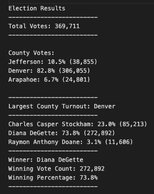

# Election_Analysis

## Project Overview
A Colorado Board of Elections employee assigned the following tasks to complete the election audit of a recent local congressional election.

1. Calculate the total number of votes cast.
2. Get a complete list of candidates who received votes.
3. Calculate the total number of votes for each candidate received. 
4. Calculate the percentage of votes each candidate won.
5. Determine the winner of the election based on popular vote.
6. Calculate the voter turnout for each county.
7. Calculate the percentage of votes from each county out of the total.
8. Determine the county with the highest turnout.

## Resources
- Data Source: election_results.csv
- Software: Python 3.7.6, Visual Studio Code 1.62.3

## Sumary
The analysis of the election shows that:

- There were 369,711 votes cast in the election.
- The candidates were:
    - Charles Casper Stockham
    - Diana DeGette
    - Raymon Anthony Doane

- The candidate results were:
    - Charles Casper Stockham received 23.0% of the vote, and a total of 85,213 votes.
    - Diana DeGette received 73.8% of the vote, and a total of 272,892 votes.
    - Raymon Anthony Doane received 3.1% of the vote, and a total of 11,606 votes.

- The winner of the election was:
    - Diana DeGette, who received 73.8% of the vote and a total of 272,892 votes.

- The voter turnout for each county was:
    - Jefferson produced 10.5% of voters, for a total of 38,855 voters.
    - Denver produced 82.8% of voters, for a total of 306,055 voters.
    - Arapahoe produced 6.7% of voters, for a total of 24,801 voters.

- The county with the largest voter turnout was:

    - Denver, which produced 82.8% of voters, for a total of 306,055 voters.

## Election-Audit Summary
Based on the information provided by the script, it is possible to expand the Election Audit by including voter turnout and considering county with candidates. 
It gives us an insight to predict election performance allowing us to manage resources if the demographics are hard to rich or the turnout is low. 

It is important to customize the script to get on-demand analysis for the following years. 

The customization suggested by adjusting the script to get the turnout results by county is a way which minor modify to the code could reveal critical data. For instance, we could include an if-statement to the code by counting the vote percentage of each  candidate.  This kind of Decision Statement reflects how the code runs calculation and all the inputs are based on the data file.  

Let’s pretend it is a federal election, we could apply this script and switch the county to states. 

 In summary, the script stablished to perform the Election Audit consist of relevant data to guide the board.
 ##